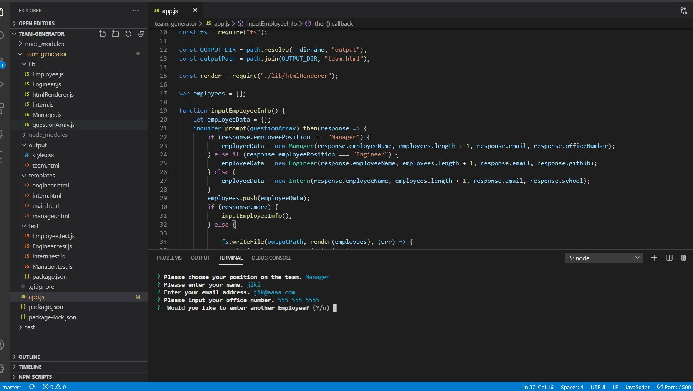
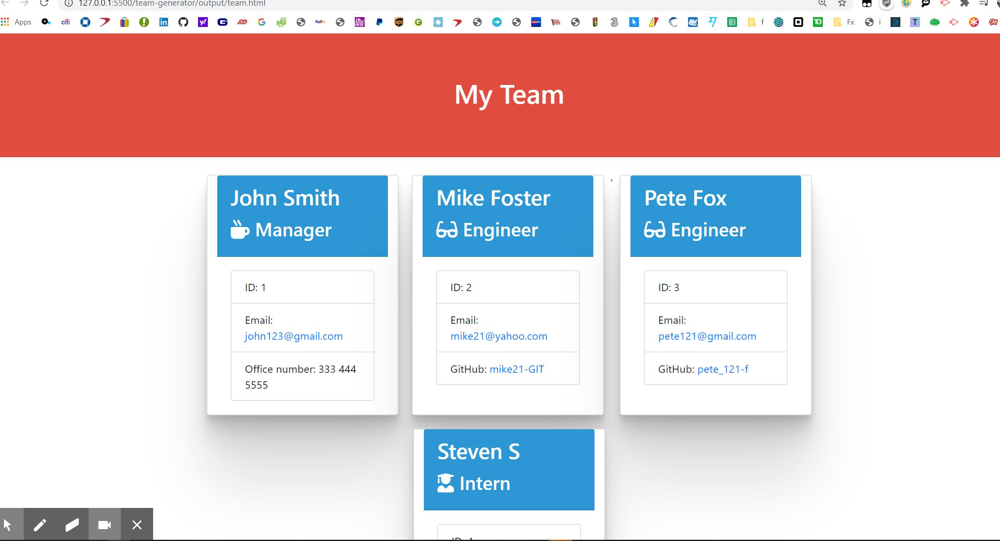

    
# Title : team-generator

## Description
Author: Jivko Atanassov

This is a simple application for creating teams of managers, engineers and trainees. The imput is in node.js vivia Inquirer, then a team.html web page is created visualizing the team and their unique info. The managers have an office phone, the engineers have a git hub account id on their profile cards, the interns have the name of the school they attend. All have their email addresses.

Github User name: zhim57

## Table of Contents:
- [Title](#title)
- [Description](#description)
- [Table of Contents](#table-of-contents)
- [Installation](#installation)
- [Usage](#usage)
- [License](#licence)
- [Contributing](#contributing)
- [Tests](#tests)
- [Questions](#questions)

## Installation
the user needs to do npm init, npm install jest, npm i inquirer, then "node app"from within the same folder as "app.js".
## Usage
- Web development/front end
- Web development back end
- Database Application
- Productivity Application
- transportation application
- other
It is targeted towards any organisation that has teams cosisting only of managers, interns and engineers, and provides access to their office numbers, atended schools and github usernames accordingly.
## Email
zhim57@yahoo.com
## Contributing
the rutgers full stack web developement bootcamp team
## License

## Tests
simulated user tests

## Questions
please email Jivko Atanassov with any questions at: zhim57@yahoo.com. Thank You!

## Links

[link to this portfolio](https://github.com/zhim57/team-generator)

[link to the deployed application](https://github.com/zhim57/team-generator)

[link for the video walk-through](https://youtu.be/ppvH5bmfEGE)
  

## Screenshots

  
